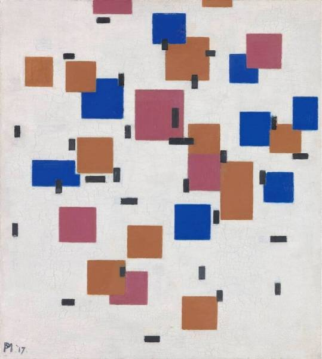
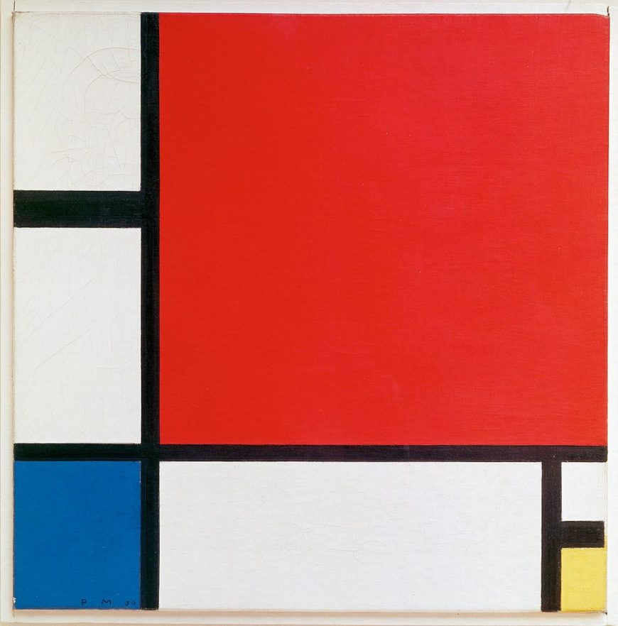
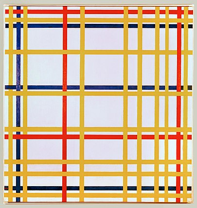
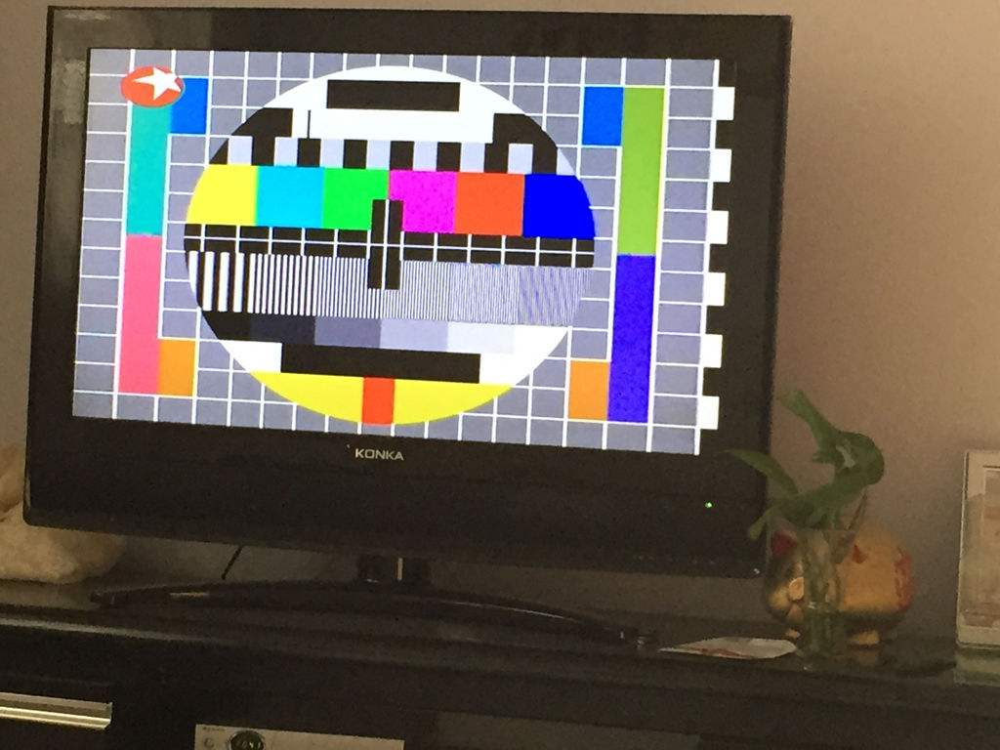

# IDEA9103-Major-Project
## How to interact with this work?

Upon opening the window, **clicking the left mouse button** will randomly change the position of the bigger rectangle on the canvas. **Pressing the 'ENTER' key** will cause these rectangles to move randomly within the canvas, bouncing off the edges upon contact. **Pressing the 'ENTER' key again** will stop the movement of the large rectangles. If you wish to reset the position of all large rectangles to their initial positions, you can **press the spacebar**.

## What is the individual's approach to animating the group's code?

**The individual's code responds to user input by detecting keyboard and mouse events to achieve dynamic interaction.** The `function mousePressed()` handles mouse click events, calling the `randomizePosition()` method to randomly reposition all rectangles when the mouse is pressed. The `function keyTyped()` handles keyboard input, specifically the pressing of the spacebar, for moving the rectangles. The `function translate()` and `function resetMatrix()` are used for translating graphics and resetting the transformation matrix, which is useful for drawing rows and columns. Additionally, the `function isOutOfBounds()` checks if elements have moved out of the canvas boundaries and stops their movement if necessary.

## What are the main coding techniques used in this work?

**User input** is the main technique used in this work.

## Which properties in the work are animated?

In this work, the **'BigRectangle'** elements are animated, which are the larger rectangles on the screen. Unlike other group members, this work primarily focuses on randomly changing the positions of elements on the canvas and provides options for user interaction to control the start and stop of position changes.

## What was the inspiration behind the work?

Regarding the inspiration behind my individual code, I initially focused on other works by the original artist *Piet Mondrian* and found many of them to be quite similar, with only changes in the positions of color blocks. Therefore, I incorporated a design to change the positions of color blocks in my code to deconstruct the image.

* *Composition in Colour A, Piet Mondrian, 1917.*
* *Piet Mondrian, Composition with Red, Blue, and Yellow, Piet Mondrian, 1930.https://smarthistory.org/*

* *New York City 1, Piet Mondrian, 1942.https://krollermuller.nl/*


Another inspiration for an effect came from memories of watching **old-fashioned television** as a child. When the TV signal was poor, there would be random moving noise and color blocks on the screen. Additionally, the ability to reset the rectangle positions by pressing the spacebar was designed to represent the signal restoration after powering the TV on and off.

* *Television without signal*
* *Television noise*
* 

## Are there any tools or techniques outside of the course used in this work?

Velocity was used to represent the distance and direction an object moves within a unit of time. 
* **Animation Effects:**
In animations, velocity is used to create smooth movement effects.
* **Collision Detection and Response:**
When the rectangular blocks are moving and may collide with the boundaries, velocity can be used to detect collisions and calculate post-collision behaviors, such as bouncing.

Specifically applied in the code for:

```javascript
// Initialize the velocity vector
initVelocity() {
  this.velocity = createVector(random(-1, 5), random(-1, 5));
}
```

## Are there any designs that didn't work out?

The original plan was that when the user long-presses the left mouse button, the Rows on the canvas start moving from bottom to top, and the Columns start moving from left to right, simulating the effect of a theatre curtain pulling open. However, I couldn't successfully apply this idea in practice, which is a great pity.


